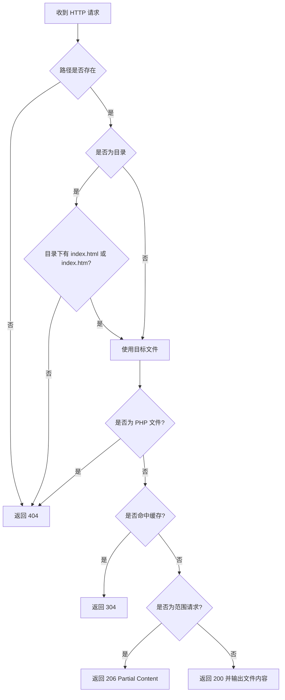

# 静态文件请求处理核心流程

```mermaid
flowchart TD
    A[收到 HTTP 请求] --> B{路径是否存在}
    B -- 否 --> G[返回 404]
    B -- 是 --> C{是否为目录}
    C -- 是 --> D{目录下有 index.html 或 index.htm?}
    D -- 否 --> G
    D -- 是 --> E[使用 index.html 或 index.htm]
    C -- 否 --> E[使用目标文件]
    E --> F{是否为 PHP 文件?}
    F -- 是 --> G
    F -- 否 --> H{是否命中缓存?}
    H -- 是 --> I[返回 304]
    H -- 否 --> J{是否为范围请求?}
    J -- 是 --> K[返回 206 Partial Content]
    J -- 否 --> L[返回 200 并输出文件内容]
    G[返回 404]
```

## 说明

- 处理流程严格阻断对 PHP 文件的访问，确保安全。
- 支持目录访问自动寻找 index.html 或 index.htm。
- 支持 ETag/Last-Modified 缓存校验。
- 支持 Range 范围请求。
- 所有异常均返回标准 HTTP 状态码。
